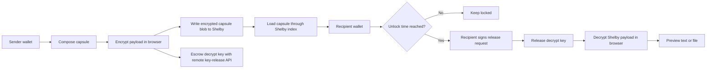
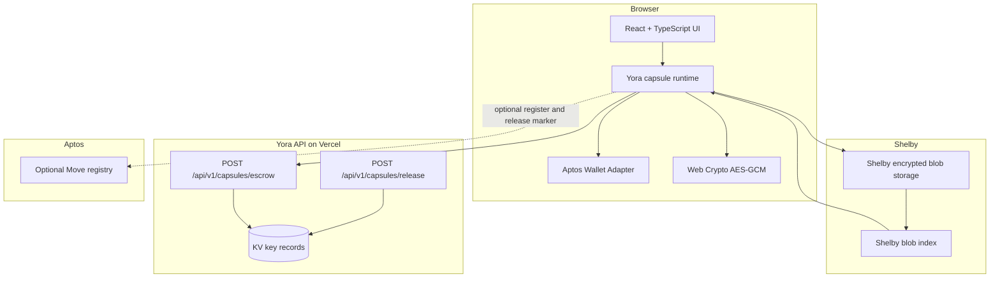

# Yora

**Yora is a time-locked encrypted capsule dApp built with Aptos wallets and Shelby decentralized hot storage.**

Yora lets a sender create a private message or file capsule for a specific recipient wallet. The payload is encrypted in the browser, stored as an encrypted Shelby blob, and can only be unsealed by the recipient wallet after the selected unlock time.

[](https://yora-nine.vercel.app)
[](https://github.com/Immomoo/Yora)
[](https://react.dev/)
[](https://www.typescriptlang.org/)
[](https://docs.shelby.xyz/)
[](https://aptos.dev/)

## Links

| Resource | URL |
| --- | --- |
| Live dApp | https://yora-nine.vercel.app |
| GitHub repository | https://github.com/Immomoo/Yora |
| Shelby docs | https://docs.shelby.xyz |
| Aptos docs | https://aptos.dev |

## Product Preview

### Landing Page


### Vault Dashboard


### Capsule Composer


## Why Yora Exists

Most private content apps solve storage and access as separate problems. Yora treats them as one flow:

1. The sender seals a payload for one recipient wallet.
2. The browser encrypts the payload before anything is written to storage.
3. Shelby stores the encrypted capsule as hot decentralized object storage.
4. The recipient wallet can discover the capsule through Shelby.
5. The capsule stays locked until the unlock timestamp.
6. After unlock, the recipient signs the release request and decrypts locally in the browser.

The result is a simple primitive for private delayed delivery: messages, files, launch notes, community drops, sealed announcements, personal handoffs, and time-based access experiments.

## Core Features

| Feature | Status | Notes |
| --- | --- | --- |
| Time-locked capsules | Implemented | Each capsule has a title, recipient wallet, payload, and unlock timestamp. |
| Message payloads | Implemented | Text capsules are encrypted and previewed after unseal. |
| File payloads | Implemented | File capsules are encrypted, downloaded after unseal, and image files can be previewed in the unseal modal. |
| Browser-side encryption | Implemented | Uses Web Crypto AES-GCM before Shelby storage. |
| Shelby blob storage | Implemented | New capsules are written as encrypted Shelby capsule envelopes. |
| Shelbynet Devnet route | Implemented and manually tested | Create, discover, unseal, file preview, remote key release, and registry UI have been tested on Shelbynet. |
| Shelby Testnet route | Implemented, pending full validation | The route and env support are present. Full end-to-end validation depends on Shelby Testnet Early Access availability. |
| Aptos wallet connection | Implemented | Uses the Aptos wallet adapter and supports wallet selection. |
| Recipient discovery | Implemented | Connected wallets load capsules addressed to them from Shelby. |
| Sender history | Implemented | Sent capsules are separated from received capsules. |
| Remote key release | Implemented | Vercel API routes escrow and release capsule keys after wallet-signature validation. |
| Cross-browser unseal | Implemented and manually tested | Recipient can unseal from a different browser when the remote key-release service is configured. |
| Aptos Move registry | Implemented as optional layer | Registers capsule metadata and records release markers when a registry address is configured. |
| Registry verification | Implemented | Discovered capsules show verified, released, missing, mismatch, unavailable, or not-enabled states. |
| Explorer links | Implemented | Shelby blob links and Aptos transaction links are shown where available. |
| Production UI | Implemented | Landing page, dashboard, create flow, capsule vault, transactions, profile, wallet picker, responsive layout, and motion polish. |

## Current Validation Status

| Area | Shelbynet Devnet | Shelby Testnet |
| --- | --- | --- |
| Network switching | Tested | Implemented |
| Wallet connection | Tested | Implemented |
| Message capsule create | Tested | Awaiting Early Access validation |
| File capsule create | Tested | Awaiting Early Access validation |
| Shelby blob write | Tested | Awaiting Early Access validation |
| Recipient discovery | Tested | Awaiting Early Access validation |
| Different browser unseal | Tested | Awaiting Early Access validation |
| Text preview after unseal | Tested | Awaiting Early Access validation |
| Image preview after unseal | Tested | Awaiting Early Access validation |
| Remote key release | Tested | Awaiting Early Access validation |
| Optional Aptos registry UI | Tested on configured route | Supported when configured |

## How It Works



## Architecture



## Capsule Envelope

Each Shelby blob stores an encrypted Yora envelope:

- capsule version
- title and recipient metadata
- creator address
- unlock timestamp
- selected Shelby route
- payload type and payload size
- blob name and digest
- encrypted ciphertext

Plaintext message and file bytes are not written to Shelby.

## Security Model

Yora is designed around a clear trust boundary:

- Payload encryption happens in the browser before Shelby writes.
- Shelby stores encrypted capsule envelopes, not plaintext payloads.
- The recipient wallet must match the capsule recipient before unseal.
- The unlock timestamp is checked before key release.
- Remote key release requires wallet-signed escrow and release messages.
- The key-release API returns the decrypt key only after validating capsule id, key id, recipient, route, blob owner, blob name, digest, and unlock time.
- Unsealed payloads are decrypted in the browser, not by the key-release service.
- If Shelby rejects the write, Yora does not create a capsule.

Important production note:

Vite exposes every `VITE_` variable to the browser bundle. If a Shelby API key must be treated as a private secret, Shelby writes should be moved behind a backend or proxy before a mainnet-grade deployment.

## What Is Not Claimed

Yora is not claiming full decentralization of key release yet. The current implementation includes a remote key-release service, but the long-term hardening path is to connect release decisions more deeply to on-chain registry state or a decentralized/threshold key management layer.

Current limitations:

- Shelby Testnet end-to-end validation is pending Early Access.
- Key release is service-backed, not threshold or fully decentralized.
- The key-release service validates stored capsule metadata, signatures, route, digest, and unlock time, but deeper registry-backed release enforcement is still a hardening target.
- Automated browser E2E tests are not yet included.
- Aptos wallet dependencies create a large production chunk; bundle splitting is a future optimization.

See [Phase 4 key release](docs/PHASE_4_KEY_RELEASE.md) for the production hardening plan.

For a dedicated trust model, metadata exposure notes, key-release assumptions, and disclosure guidance, see [SECURITY.md](SECURITY.md).

## Network Support

Yora supports two selectable Shelby routes.

| Route | Purpose | Frontend env |
| --- | --- | --- |
| Shelbynet Devnet | Development route used for current successful manual testing | `VITE_SHELBYNET_API_KEY` |
| Shelby Testnet | Testnet route prepared for Early Access validation | `VITE_SHELBY_TESTNET_API_KEY` |

The selected route controls:

- Shelby client configuration
- Shelby blob base URL
- Aptos wallet network expectation
- registry address lookup
- explorer links
- dashboard status labels

## Quick Start

```bash
npm install
npm run dev
```

Open the local Vite URL shown in the terminal.

## Production Build

```bash
npm run build
```

The compiled app is generated in `dist/`.

## Environment Variables

Copy `.env.example` to `.env` for local development.

```bash
VITE_YORA_NETWORK=testnet
VITE_APTOS_API_KEY=
VITE_SHELBYNET_APTOS_API_KEY=
VITE_SHELBY_API_KEY=
VITE_SHELBYNET_API_KEY=
VITE_SHELBY_TESTNET_API_KEY=
VITE_YORA_KEY_RELEASE_URL=
VITE_YORA_KEY_RELEASE_PUBLIC_KEY=
VITE_YORA_REGISTRY_ADDRESS=
VITE_YORA_SHELBYNET_REGISTRY_ADDRESS=
VITE_YORA_TESTNET_REGISTRY_ADDRESS=
YORA_KEY_RELEASE_PRIVATE_KEY=
YORA_KV_REST_API_URL=
YORA_KV_REST_API_TOKEN=
```

Do not commit `.env` or real API keys. Local environment files are ignored by the repository.

### Frontend Variables

| Variable | Purpose |
| --- | --- |
| `VITE_YORA_NETWORK` | Default route when the app opens. Use `shelbynet` or `testnet`. |
| `VITE_APTOS_API_KEY` | Aptos API key used by the wallet adapter on Shelby Testnet. |
| `VITE_SHELBYNET_APTOS_API_KEY` | Optional Aptos API key override for Shelbynet. |
| `VITE_SHELBY_API_KEY` | Shared Shelby API key fallback for both Shelby routes. |
| `VITE_SHELBYNET_API_KEY` | Shelby API key for Shelbynet writes. |
| `VITE_SHELBY_TESTNET_API_KEY` | Shelby API key for Shelby Testnet writes. |
| `VITE_YORA_KEY_RELEASE_URL` | Enables remote key release when set, for example `https://yora-nine.vercel.app/api`. |
| `VITE_YORA_KEY_RELEASE_PUBLIC_KEY` | RSA-OAEP public key used by the browser to encrypt capsule keys before escrow. |
| `VITE_YORA_REGISTRY_ADDRESS` | Optional fallback Aptos Move registry address. |
| `VITE_YORA_SHELBYNET_REGISTRY_ADDRESS` | Optional Shelbynet registry address. |
| `VITE_YORA_TESTNET_REGISTRY_ADDRESS` | Optional Shelby Testnet registry address. |

### Server-Only Variables

| Variable | Purpose |
| --- | --- |
| `YORA_KEY_RELEASE_PRIVATE_KEY` | RSA-OAEP private key used by the API to decrypt escrowed capsule keys after validation. |
| `YORA_KV_REST_API_URL` | REST endpoint for durable key-release storage. |
| `YORA_KV_REST_API_TOKEN` | Token for durable key-release storage. |

## Key-Release API

Yora includes Vercel API routes for remote key escrow and release:

```text
POST /api/v1/capsules/escrow
POST /api/v1/capsules/release
```

Generate the RSA-OAEP keypair:

```bash
npm run key-release:keys
```

Set the public key in the frontend environment:

```bash
VITE_YORA_KEY_RELEASE_PUBLIC_KEY=<generated-public-key>
VITE_YORA_KEY_RELEASE_URL=https://yora-nine.vercel.app/api
```

Set the private key and KV credentials as server-only Vercel environment variables:

```bash
YORA_KEY_RELEASE_PRIVATE_KEY=<generated-private-key>
YORA_KV_REST_API_URL=<kv-rest-url>
YORA_KV_REST_API_TOKEN=<kv-rest-token>
```

The key-release API verifies wallet-signed messages with Aptos Ed25519 signatures. It records encrypted key material in KV and appends release events when a recipient successfully unseals a capsule.

## Aptos Move Registry

The optional Move registry package lives in `move/`.

It records metadata only:

- capsule id
- creator
- recipient
- unlock timestamp
- Shelby route
- blob owner
- blob name
- ciphertext digest
- payload kind and size
- release marker

The encrypted payload remains on Shelby.

Compile:

```bash
npm run move:compile -- --named-addresses yora=<publisher-address>
```

Publish:

```bash
npm run move:publish -- --named-addresses yora=<publisher-address>
```

Initialize once on the same network:

```bash
aptos move run --function-id <publisher-address>::yora_registry::initialize
```

Then set the matching frontend variable:

```bash
VITE_YORA_SHELBYNET_REGISTRY_ADDRESS=<shelbynet-publisher-address>
VITE_YORA_TESTNET_REGISTRY_ADDRESS=<testnet-publisher-address>
```

`VITE_YORA_REGISTRY_ADDRESS` remains available as a fallback when both routes share the same publisher address.

## Deployment

Yora is deployed on Vercel:

```text
https://yora-nine.vercel.app
```

For production deployments:

1. Configure the same frontend variables from `.env.example`.
2. Configure server-only key-release variables in Vercel project settings.
3. Configure the durable KV integration used by the key-release API.
4. Set the correct registry address for the selected route if registry writes should be active.
5. Run `npm run build` before deploying.

## Manual Test Checklist

The following flow has been manually validated on Shelbynet:

- Connect sender wallet.
- Select Shelbynet route.
- Create text capsule for recipient wallet.
- Create image/file capsule for recipient wallet.
- Confirm Shelby blob write succeeds.
- Confirm optional registry status appears when configured.
- Switch to recipient wallet.
- Confirm dashboard and capsule page show only capsules for the active wallet.
- Unseal after unlock time.
- Confirm text preview appears.
- Confirm image preview appears for image payloads.
- Confirm unseal works from a different browser when remote key release is configured.

Recommended next automated checks:

- render smoke test for landing, dashboard, create, capsules, transactions, and profile pages
- wallet network mismatch UI test
- recipient discovery regression test
- unseal modal preview test
- key-release API request validation test

## Repository Structure

```text
api/
  _keyRelease.js              Shared key-release API helpers
  v1/capsules/escrow.js       Remote key escrow endpoint
  v1/capsules/release.js      Remote key release endpoint
docs/
  PHASE_4_KEY_RELEASE.md      Production key-release hardening notes
  assets/                     README screenshots
move/
  sources/yora_registry.move  Optional Aptos Move registry module
public/
  favicon.svg                 Yora favicon
  og-image.png                Social preview image
src/
  App.tsx                     Main application shell and dApp flows
  main.tsx                    Aptos wallet provider and React entry
  styles.css                  Product UI, responsive layout, and motion
  types.ts                    Capsule and registry types
  lib/
    address.ts                Address normalization helpers
    aptosRegistry.ts          Registry transactions and verification reads
    bytes.ts                  Encoding helpers
    crypto.ts                 AES-GCM encryption and decryption
    keyRelease.ts             Browser and remote key-release adapter
    shelby.ts                 Shelby route configuration
    shelbyCapsules.ts         Capsule envelope encoding and Shelby discovery
    storage.ts                Shelby blob reading helpers
```

## Tech Stack

- React 18
- TypeScript
- Vite
- Aptos TypeScript SDK
- Aptos Wallet Adapter
- Shelby Protocol SDK
- Shelby React SDK
- Web Crypto API
- Vercel API routes
- KV-style REST storage for key records
- Aptos Move for optional registry metadata

## Roadmap

Near-term:

- Validate the full flow on Shelby Testnet after Early Access is available.
- Add automated E2E coverage for create, discover, unseal, and preview flows.
- Improve bundle splitting around Aptos wallet and SDK dependencies.
- Add deeper API observability for key-release failures and release events.

Production hardening:

- Connect key-release decisions to registry state before returning keys.
- Add stricter replay protection and operational key rotation.
- Evaluate decentralized or threshold key management for future release guarantees.
- Add a documented threat model and independent security review before broader use.

## Submission Summary

Yora is already a working Shelbynet dApp with encrypted Shelby storage, recipient discovery, remote key release, file preview, and optional Aptos registry receipts. The Shelby Testnet route is implemented and ready for validation once Early Access is available.

## License

This repository is currently published for Yora development and community review. Add a license before wider reuse or external contribution.
