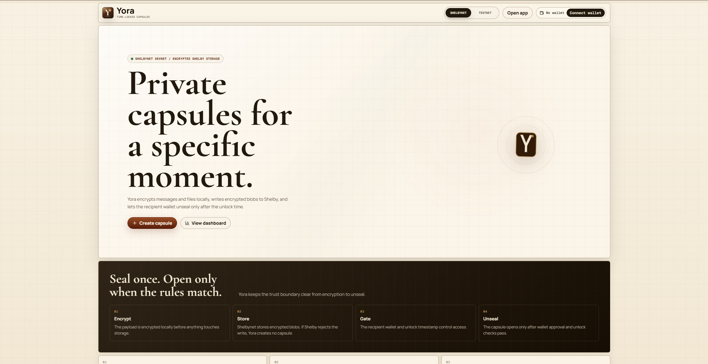
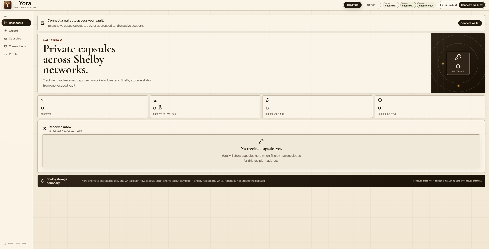
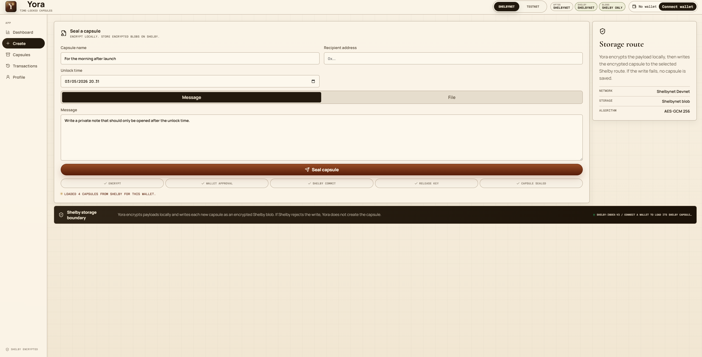
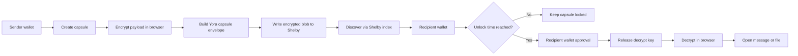
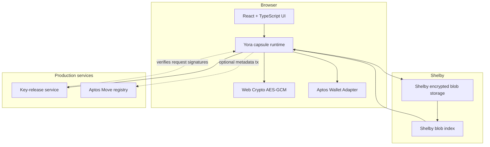

# Yora

**Yora is a time-locked encrypted capsule dApp for Aptos and Shelby.**

Yora lets users seal private messages or files, encrypt payloads locally in the browser, write encrypted capsule blobs to Shelby decentralized hot storage, and let the intended recipient wallet unseal the capsule after the selected unlock time.

[](https://yora-nine.vercel.app)
[](https://react.dev/)
[](https://www.typescriptlang.org/)
[](https://docs.shelby.xyz/)
[](https://aptos.dev/)

## Preview

### Landing Page



### Vault Dashboard



### Capsule Composer



## What Yora Does

Yora is designed around one simple primitive: **a private capsule that should only become readable by a specific wallet after a specific time.**

The dApp currently supports:

- Message capsules
- File capsules
- Browser-side payload encryption before storage
- Shelby blob writes
- Shelbynet Devnet and Shelby Testnet route switching
- Aptos wallet connection
- Recipient-based capsule discovery
- Sent and received capsule views
- Unlock-time checks
- Shelby explorer links for outgoing blob writes
- Production-style UI with responsive layout and motion polish

## Current Product Status

| Area | Status | Notes |
| --- | --- | --- |
| Browser-side encryption | Implemented | Payloads are encrypted before storage. Current implementation uses Web Crypto AES-GCM. |
| Shelby blob storage | Implemented | New capsules are written as encrypted Shelby blobs. |
| Shelbynet route | Implemented | Uses the Shelbynet Shelby blob endpoint and API key. |
| Shelby Testnet route | Implemented | Uses the Shelby Testnet blob endpoint and API key. |
| Aptos wallet connection | Implemented | Uses the Aptos wallet adapter. |
| Recipient discovery | Implemented | Yora indexes Shelby capsule envelopes addressed to the connected wallet. |
| Sent / received separation | Implemented | Capsule cards identify inbound and outbound capsules. |
| Explorer links | Implemented | Outgoing writes link to the Shelby explorer. |
| Remote key release | Integrated | Frontend supports a remote key-release API through env configuration. See [Phase 4 key release](docs/PHASE_4_KEY_RELEASE.md). |
| Aptos Move registry | Integrated, pending deployment address | Optional registry module exists in [`move/`](move/README.md). Publish it per network and set `VITE_YORA_SHELBYNET_REGISTRY_ADDRESS` / `VITE_YORA_TESTNET_REGISTRY_ADDRESS` to activate registry writes and release markers. |

## How It Works



## Architecture



## Capsule Lifecycle

1. **Compose**
   The sender enters a capsule name, recipient wallet address, unlock time, and either a message or file.

2. **Encrypt**
   Yora encrypts the payload in the browser with Web Crypto before storage.

3. **Store**
   Yora writes a capsule envelope containing encrypted payload metadata and ciphertext to the selected Shelby network.

4. **Discover**
   The recipient wallet can discover capsules addressed to it through the Shelby index.

5. **Unseal**
   After the unlock time, the recipient wallet approves the unseal flow and Yora decrypts the Shelby blob in the browser.

## Network Support

Yora supports two Shelby routes:

| Route | Purpose |
| --- | --- |
| Shelbynet Devnet | Developer route for Shelbynet testing. |
| Shelby Testnet | Public Shelby test environment. |

The selected route controls the Shelby client, blob endpoint, and displayed network state.

## Environment Variables

Copy `.env.example` to `.env` for local development.

```bash
VITE_YORA_NETWORK=testnet
VITE_APTOS_API_KEY=
VITE_SHELBYNET_APTOS_API_KEY=
VITE_SHELBY_API_KEY=
VITE_SHELBYNET_API_KEY=
VITE_SHELBY_TESTNET_API_KEY=
VITE_YORA_KEY_RELEASE_URL=
VITE_YORA_KEY_RELEASE_PUBLIC_KEY=
VITE_YORA_REGISTRY_ADDRESS=
VITE_YORA_SHELBYNET_REGISTRY_ADDRESS=
VITE_YORA_TESTNET_REGISTRY_ADDRESS=
YORA_KEY_RELEASE_PRIVATE_KEY=
YORA_KV_REST_API_URL=
YORA_KV_REST_API_TOKEN=
```

Do not commit `.env` or real API keys. The repository ignores local environment files.

> Important: Vite exposes `VITE_` variables to the browser bundle. If Shelby API keys must be treated as private secrets, move Shelby writes behind a backend/proxy before mainnet-grade production use.

The `YORA_` variables without `VITE_` are server-only values used by the key-release API. Keep them private in Vercel project settings.

## Local Development

```bash
npm install
npm run dev
```

Open the local Vite URL shown in the terminal.

## Production Build

```bash
npm run build
```

The compiled app is generated in `dist/`.

## Key-Release API

Yora includes Vercel API routes for production key release:

```text
POST /api/v1/capsules/escrow
POST /api/v1/capsules/release
```

Generate RSA-OAEP keys for the service:

```bash
npm run key-release:keys
```

Set `VITE_YORA_KEY_RELEASE_PUBLIC_KEY` in the frontend environment and keep `YORA_KEY_RELEASE_PRIVATE_KEY` server-only. The API stores encrypted key records through `YORA_KV_REST_API_URL` and `YORA_KV_REST_API_TOKEN`.

## Aptos Registry

The optional Move registry package is in `move/`.

```bash
npm run move:compile -- --named-addresses yora=<publisher-address>
npm run move:publish -- --named-addresses yora=<publisher-address>
```

After publishing, initialize the registry and set the matching address:

```bash
VITE_YORA_SHELBYNET_REGISTRY_ADDRESS=<shelbynet-publisher-address>
VITE_YORA_TESTNET_REGISTRY_ADDRESS=<testnet-publisher-address>
```

`VITE_YORA_REGISTRY_ADDRESS` remains available as a fallback if both routes use the same publisher address.

## Deployment

Yora is deployed on Vercel:

```text
https://yora-nine.vercel.app
```

For Vercel deployments, configure the same environment variables from `.env.example` in the Vercel project settings.

## Security Model

Yora currently provides:

- Browser-side payload encryption before storage
- Encrypted-only Shelby blob writes
- Recipient address filtering for capsule discovery
- Unlock-time checks before unseal
- Wallet approval before decrypt flow
- No local capsule fallback when Shelby writes fail
- Optional remote key-release API integration
- Optional Aptos Move registry write after Shelby accepts a blob

Implementation detail: the current browser encryption helper uses AES-GCM 256 through the Web Crypto API.

Yora does **not** yet provide:

- Deployed decentralized key release
- Published Aptos Move registry address by default
- Threshold encryption or decentralized key management
- Mainnet-grade key custody

The recommended hardening path is documented in [Phase 4 key release](docs/PHASE_4_KEY_RELEASE.md).

## Repository Structure

```text
src/
  App.tsx                 Main application shell and dApp flows
  styles.css              Product UI, responsive layout, and animations
  lib/
    crypto.ts             AES-GCM encryption and decryption helpers
    shelby.ts             Shelby route configuration
    shelbyCapsules.ts     Capsule envelope encoding and Shelby discovery
    keyRelease.ts         Current development key-release adapter
    aptosRegistry.ts      Optional Aptos Move registry transaction builder
    storage.ts            Shelby blob reading
    address.ts            Address normalization helpers
docs/
  PHASE_4_KEY_RELEASE.md  Production key-release plan
  assets/                 README screenshots
move/
  sources/                Optional Aptos Move registry module
```

## Tech Stack

- React
- TypeScript
- Vite
- Aptos Wallet Adapter
- Shelby Protocol SDK
- Shelby React SDK
- Web Crypto API

## Roadmap

- Replace the development key-release adapter with a production key-release service.
- Deploy the Aptos Move registry and configure `VITE_YORA_REGISTRY_ADDRESS`.
- Add automated tests for wallet switching, recipient discovery, and network route behavior.
- Add server-side or contract-backed verification for production unseal guarantees.
- Improve bundle splitting around Aptos wallet dependencies.

## License

This repository is currently published for Yora development and community review. Add a license before wider reuse or external contribution.
