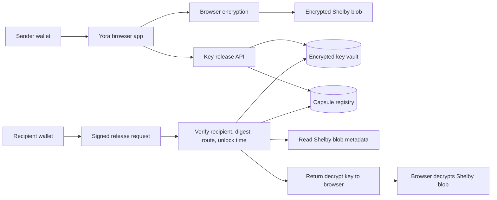

# Phase 4: Production Key Release

Yora already writes encrypted capsule blobs to Shelby. The remaining production gap is key release: the AES decrypt key must not depend on browser localStorage.

## Goal

Move Yora from a development key-release adapter to a production release path where:

- encrypted payloads stay on Shelby,
- plaintext payloads never touch the server,
- decrypt keys are released only to the recipient wallet,
- unlock time is enforced outside the browser,
- each release can be audited against the capsule digest and Shelby blob pointer.

## Target Architecture



## MVP Direction

Build a small key-release service that stores capsule keys server-side and releases them only after validation. This is the fastest production hardening step because it removes key custody from localStorage while keeping the current Shelby storage flow intact.

## MVP Scope

- Add `VITE_YORA_KEY_RELEASE_URL` to the frontend.
- During seal, upload encrypted capsule data to Shelby first.
- After Shelby confirms the blob write, escrow only the decrypt key and capsule metadata to the key-release service.
- During unseal, require the connected recipient wallet to sign a release request.
- The service verifies recipient address, unlock timestamp, capsule digest, blob pointer, and selected Shelby route.
- If valid, the service returns the AES key so the browser can decrypt the Shelby blob locally.

## API Shape

### `POST /v1/capsules/escrow`

Called after Shelby accepts the encrypted blob write.

Required fields:

- `capsuleId`
- `creator`
- `recipient`
- `unlockAt`
- `shelbyNetwork`
- `blobName`
- `blobOwner`
- `ciphertextDigest`
- `payloadKind`
- `sizeBytes`
- `encryptedKey`
- `creatorSignature`

Validation:

- creator signature must match the connected creator wallet,
- blob pointer must match the selected Shelby route,
- digest must match the capsule envelope written to Shelby,
- duplicate capsule ids must be rejected unless the payload digest is identical.

### `POST /v1/capsules/release`

Called by the recipient during unseal.

Required fields:

- `capsuleId`
- `recipient`
- `shelbyNetwork`
- `blobName`
- `ciphertextDigest`
- `timestamp`
- `recipientSignature`

Validation:

- recipient signature must match the capsule recipient,
- current server time must be greater than or equal to `unlockAt`,
- requested digest and blob pointer must match the escrowed capsule,
- Shelby blob must still be readable,
- release attempts should be rate limited and logged.

Response:

- `key`
- `algorithm`
- `capsuleId`
- `releasedAt`

## Data Model

```text
capsules
  id
  creator
  recipient
  unlock_at
  shelby_network
  blob_owner
  blob_name
  ciphertext_digest
  payload_kind
  size_bytes
  status
  created_at

keys
  capsule_id
  encrypted_key
  key_version
  created_at

release_events
  id
  capsule_id
  recipient
  wallet_signature_digest
  released_at
  result
```

## Production-Harder Scope

- Add an Aptos Move registry for capsule metadata, recipient, unlock timestamp, blob pointer, and digest.
- Make the key-release service verify registry state before releasing keys.
- Later, replace the centralized release service with threshold or decentralized key management if the Shelby ecosystem supports that path.

## Milestones

| Milestone | Scope | Exit Criteria |
| --- | --- | --- |
| 4.1 API contract | Define request/response types and frontend client wrapper. | Yora can switch between local adapter and remote release API by env var. |
| 4.2 Escrow service | Store decrypt keys after confirmed Shelby writes. | Failed escrow does not create a usable capsule; duplicate writes are rejected safely. |
| 4.3 Release verification | Verify recipient signature, unlock time, digest, route, and blob pointer. | Wrong wallet, early unlock, wrong network, and tampered digest all fail. |
| 4.4 Audit trail | Record release attempts and successful releases. | Every unseal has a capsule id, recipient, timestamp, and result. |
| 4.5 Aptos registry | Publish capsule metadata to an Aptos Move registry. | Key release verifies on-chain capsule state before returning a key. |
| 4.6 Decentralized release research | Evaluate threshold or decentralized key release. | Documented path to reduce trust in a single key-release service. |

## Frontend Integration Notes

- Keep browser-side encryption unchanged.
- Keep Shelby as the source of encrypted payload storage.
- Replace `src/lib/keyRelease.ts` with an adapter interface:
  - `localKeyReleaseAdapter` for development,
  - `remoteKeyReleaseAdapter` for production.
- Show release-service health in the profile or storage boundary area.
- If remote key escrow fails after Shelby upload, mark the capsule as incomplete and do not show it as unlockable.

## Acceptance Tests

- Sender can seal a capsule only after Shelby accepts the encrypted blob.
- Recipient can discover the capsule through Shelby.
- Recipient cannot unseal before `unlockAt`.
- Non-recipient wallet cannot release the key.
- Tampered digest cannot release the key.
- Wrong Shelby route cannot release the key.
- Expired or replayed signatures are rejected.
- Successful unseal returns the key but never returns plaintext from the service.

## Non-Goals

- Do not store plaintext decrypt keys in Shelby.
- Do not treat localStorage key vault as production-safe.
- Do not mark unseal as fully decentralized until the key-release path is contract-backed or threshold-backed.

## Current Status

Yora's Shelbynet storage flow has been tested successfully. Shelby Testnet routing is implemented in the dApp, but full testnet validation depends on Early Access availability.

Implemented in this repository:

- remote key-release frontend adapter,
- Vercel API routes for key escrow and release,
- deterministic creator escrow message,
- deterministic recipient release message,
- RSA-OAEP encryption of escrowed capsule keys before they are sent to the remote release API,
- server-side decrypt of escrowed keys only after release validation,
- Upstash/Vercel KV-style REST storage for encrypted key records,
- Ed25519 wallet signature verification for the key-release API,
- optional `VITE_YORA_KEY_RELEASE_URL` switch,
- optional `VITE_YORA_KEY_RELEASE_PUBLIC_KEY` switch.

Still required outside this frontend repo:

- configure durable KV credentials in Vercel,
- connect the service to the Aptos registry once published,
- rotate the RSA private key with an operational key-management process.

## Deploying the Key-Release API

Generate a keypair:

```bash
npm run key-release:keys
```

Set the public key in frontend env:

```bash
VITE_YORA_KEY_RELEASE_PUBLIC_KEY=<generated-public-key>
VITE_YORA_KEY_RELEASE_URL=https://yora-nine.vercel.app/api
```

Set these as server-only Vercel env variables:

```bash
YORA_KEY_RELEASE_PRIVATE_KEY=<generated-private-key>
YORA_KV_REST_API_URL=<upstash-or-vercel-kv-rest-url>
YORA_KV_REST_API_TOKEN=<upstash-or-vercel-kv-rest-token>
```

The API endpoints are:

```text
POST /api/v1/capsules/escrow
POST /api/v1/capsules/release
```
